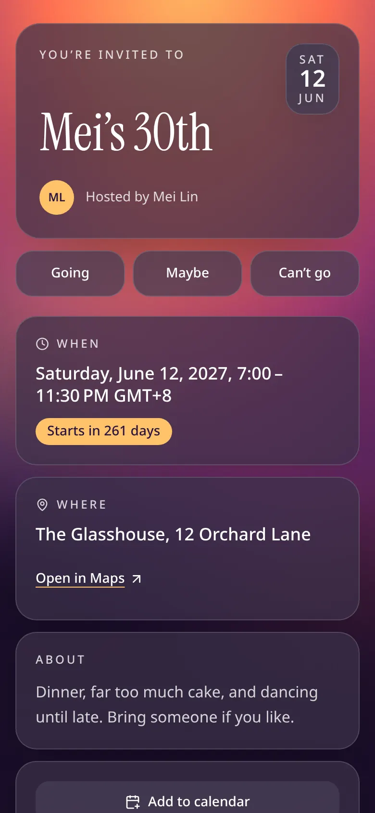
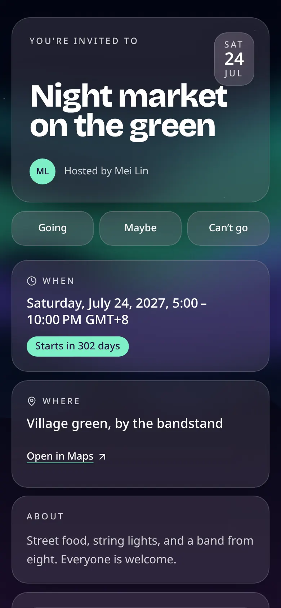
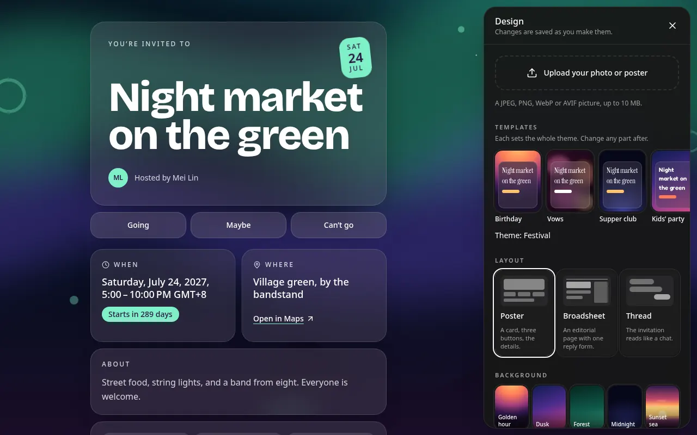
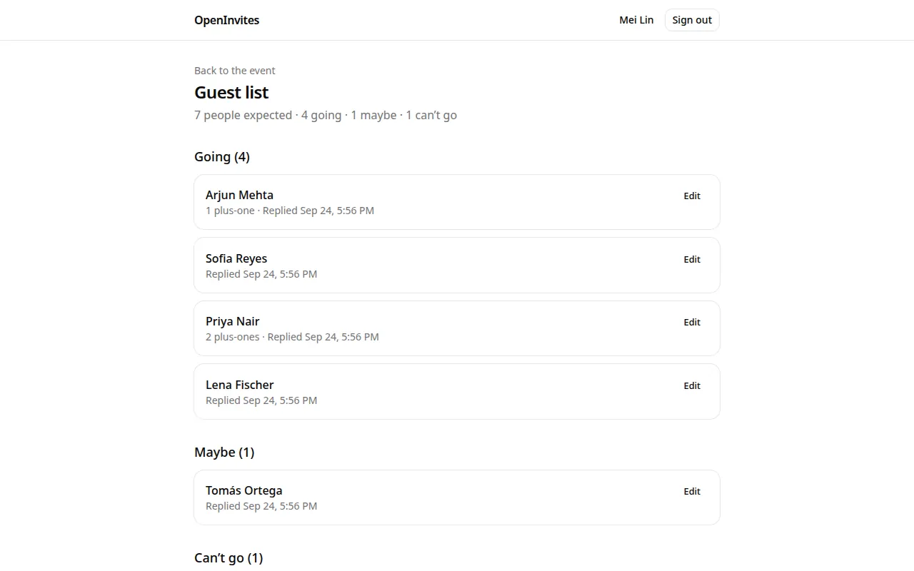

# OpenInvites

Invitations you host yourself. A host makes an event page that looks like an invitation and shares its link. Guests open it on their phone and reply, with no account and no app. The host watches the guest list fill up.

OpenInvites is open source and made to be self-hosted: one Compose file runs it on a small server or a Raspberry Pi. It sends nothing to the project or to anyone else.

<p>
  
  
  
</p>
<p>
  
</p>
<p>
  
</p>

## What it does

- **Event pages worth opening.** Six templates to start from, three layouts (a poster, an editorial page, or a chat with the host), a gallery of backgrounds or the host's own photo or poster, four title fonts, an accent colour, and an effect. Whatever the host picks, the text stays readable.
- **Replies without an account.** Guests answer Going, Maybe or Can't go, bring plus-ones, answer the host's questions, and change their answer later from the same phone or a private edit link. They can add the event to their calendar, open the place in their maps, and once they have replied, talk with the host and each other in the comments.
- **A guest list that keeps itself.** The host sees who is coming and the headcount as replies arrive, is emailed as they do, and chooses whether guests see the list. Announcements go on the page and to guests' inboxes, guests who gave an email are reminded before the event, and co-hosts can share the work. The link can be shared, shown as a QR code, and unfurls into a preview card.
- **An instance you run.** The first account becomes the operator, who decides whether anyone may sign up or only the hosts they invite. Email and password sign-in or a link by email, with Google and GitHub when configured. Pages in English, Simplified Chinese and Traditional Chinese, following each visitor's browser.

## Run it locally

You need [Git](https://git-scm.com/), [Node.js](https://nodejs.org/) 22, [pnpm](https://pnpm.io/) 10, and [Docker](https://docs.docker.com/get-docker/) with Compose. `corepack enable` gives you the pnpm version the repository names (you may need `sudo`); `npm install --global pnpm@10` works too.

```sh
git clone https://github.com/leongyeehang/OpenInvites.git
cd OpenInvites
pnpm install
pnpm dev
```

`pnpm install` may end by saying it ignored the build scripts of a few packages: nothing here needs them. `pnpm dev` starts Postgres 18 and [Mailpit](https://mailpit.axllent.org/), a fake mail server that catches every email the app sends (their images are downloaded the first time), then starts the app, which brings its database up to date before it answers the first request. It needs ports 3000, 5432, 1025 and 8025 free.

1. Open <http://localhost:3000> and choose **Create an account**. The first account on a new instance becomes its operator.
2. Open Mailpit at <http://localhost:8025> and follow the link in **Verify your email for OpenInvites**.
3. On your dashboard, choose **New event**, fill it in, and **Save draft**. Then **Publish** it and **Open the event page**. The **Design** button there opens the drawer in the screenshot above.

Stop it with Ctrl-C, then `docker compose --profile dev down` to stop the containers (add `-v` to delete the database).

## Run an instance

The deployment package in [`deploy/`](deploy/) runs the published image with Postgres and [Caddy](https://caddyserver.com/) for automatic HTTPS, on amd64 or arm64:

- [Installing an instance](docs/operator/install.md): from a fresh machine to a running instance with HTTPS.
- [Configuring an instance](docs/operator/configuration.md): every setting, including mail, Google and GitHub sign-in, S3 storage, rate limits, and the privacy and terms pages.
- [Upgrading, backups, and operations](docs/operator/upgrade-backup.md): upgrades, backup and restore, and resetting a host's password.

## Contribute

Bug reports, ideas, translations, templates, and code are all welcome. [CONTRIBUTING.md](CONTRIBUTING.md) covers the development setup, the tests, how issues and pull requests work, and the sign-off every commit carries. New templates, backgrounds and languages are data files, with a guide each in [`docs/contributing/`](docs/contributing/). Everyone taking part follows the [code of conduct](CODE_OF_CONDUCT.md).

## Licence

OpenInvites is free software under the [GNU Affero General Public License](LICENSE), version 3 or (at your option) any later version (`AGPL-3.0-or-later`). If you run a modified version for others, the licence asks you to offer them its source.
